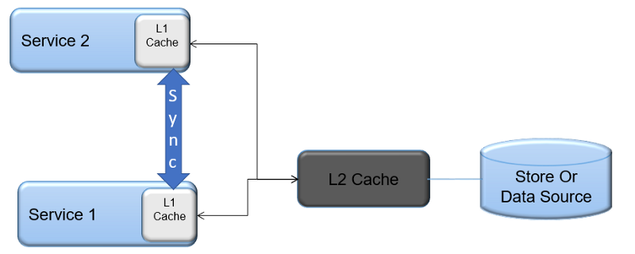
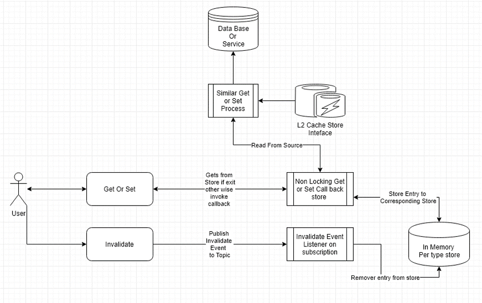

# Distributed Multilevel Caching for Micro-services`

## 1. Why distributed caching ?

In this era of micro services & server-less computing, create numerous services which needs to communicate & collaborate together to serve requests. This causes lots of I/O operations & calls. Usually we use caching to to reduce I/O. Generally we know about caching. Here we discuss how to effectively use caching so that we can get meet scale & efficiency. Idea is taken from Caching in CPU
Below is diagram that as a primer for caching in CPU

Cpu - caching

## 2. How this applies to Micro-services ?

Lets consider an scenario of a health care portal, where we have to show certain information from different sub systems/services

       1. Net total of items/services bought - fetched using transaction/order ID
       2. Subscription & details owned by the user - fetched by subscription ID
       3. User features , permission, etc, etc - from user ID
       4. Associated User Account of family member & plans - Using Group ID

Here you can see that some information (ex: '2,3' item in above list) is required by many services & is used under very high frequency where as some items are of lower precedence, but again is candidate for caching. So one type of caching won't fit for all, and will eventually cause unwanted issues especially under load conditions 🙏  ,also  as we will be hitting too much IO or systems limits. say if we are using Redis , the latency & availability incorporated is high when compared to in Memory Collection.

## 3. What should be the right approach ?

I should remind the fact that  caching should be the last resort in achieving performance, our strategy here is to hit a sweet spot by using multi level caching & fallback to actual store. Very high frequently accessed data are used can be stored "in Memory Cache - L1 level distributed cache " then either paged or reflected to "L2 Cache - ex :Redis, Apache ignite,ncache etc". Here the advantage is that there can be multiple algorithms & strategies in each level to enhance efficiency. One crucial advantage is that other services can observe event streams and do additional data prefetching  as required. This prefetching approach lets us operate our caching across services as efficient as possible.
sample diagram

